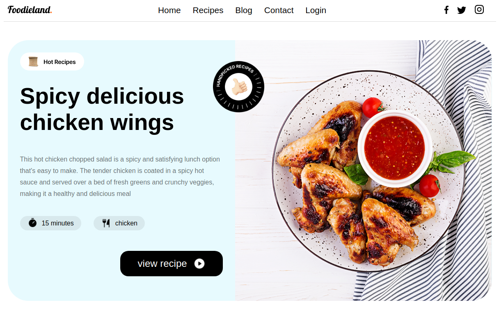
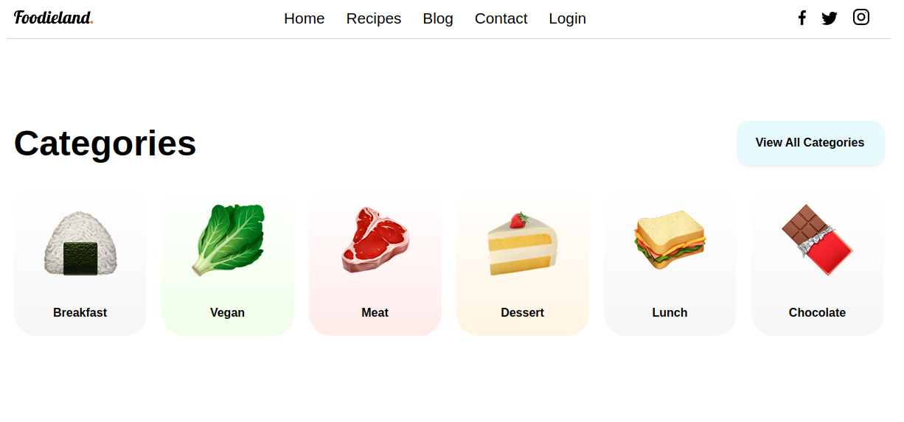
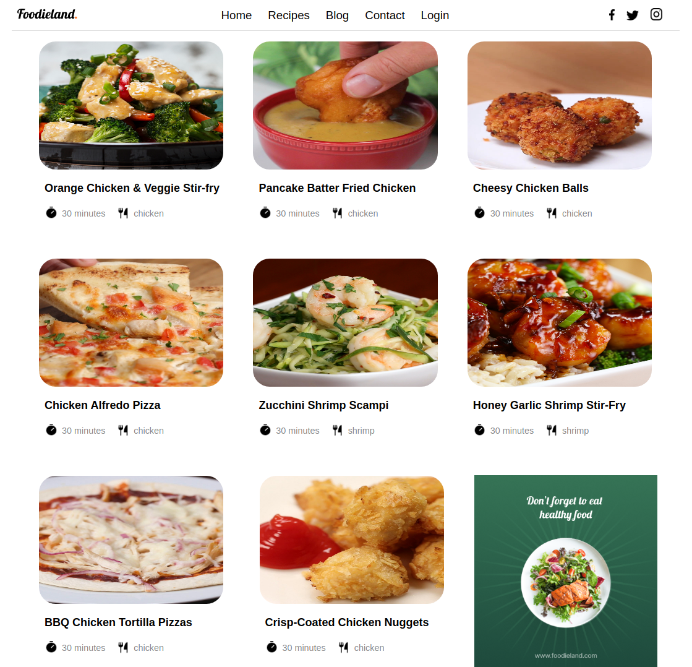

# Tasty Dish Frontend

React/Redux frontend for a social recipe sharing and discovery platform.

## 🚀 Live Demo

[View Live Application](https://tastydish-client-4okn.vercel.app/)

## 🔗 Backend Repository

The backend API for this project is located at:  
[tasty-dish-backend](https://github.com/yasmein0o0/Biscmarket-server)

## 📸 Screenshots

## 🛠️ Tech Stack

### Frontend Technologies

- **React** - Component-based UI framework
- **Redux** - State management for user sessions and recipe data
- **JavaScript (ES6+)** - Core programming language
- **SASS** - Advanced CSS with variables and mixins for maintainable styling
- **HTML5** - Semantic markup structure
- **Axios** - HTTP client for API communication

### Key Features Implemented

- Recipe gallery with search and filtering capabilities
- User authentication and profile management
- Interactive recipe creation and editing forms
- Favorite recipes collection system
- Fully responsive design for all devices
- JWT authentication flow with protected routes
- Real-time search and category filtering

## 🚦 Local Development Setup

### Prerequisites

- Node.js (v14 or higher)
- npm
